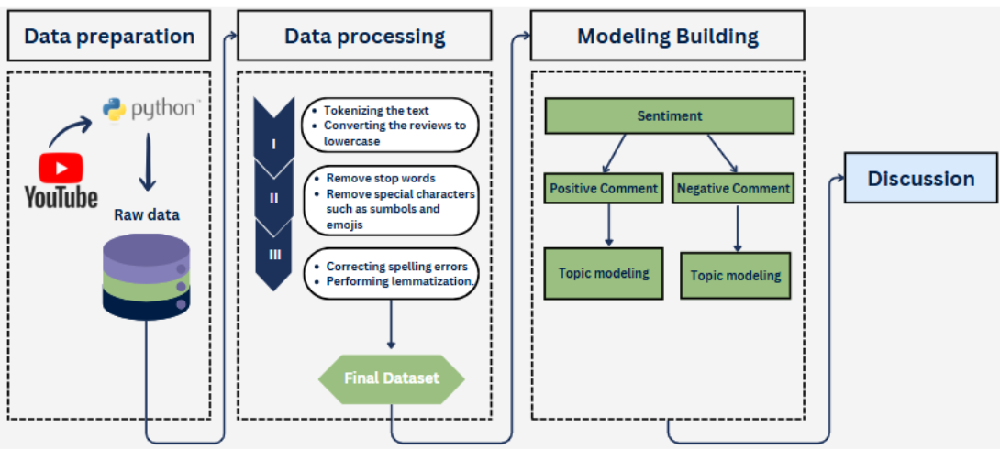

# 🚗 Public Opinion toward Vinfast Vehicles: A study based on Data Analysis 
> An end-to-end Python project that analyzes public sentiment
## Problem Statement
As VinFast expands globally, it faces mixed public perception. This project explores public sentiment to help improve brand positioning and product strategy.

## Research Objectives
* To uncover key themes and sentiments shaping public perception of Vinfast electric vehicles (EVs) in Vietnam through large-scale analysis of user-generated content.
* Suggest actionable strategies to enhance public acceptance and adoption.
  
## ❓Research Questions?
* **RQ1:**  What topics emerge from user-generated content about VinFast EVs?
* **RQ2:** What factors contribute to negative  consumer perceptions, and how can these perceptions be improved?

## Data collection
* Data source: Youtube
* Algorithms: Sentiment and Topic Modeling
* Tool: Python
* Platform: Google Colab
* **API V3: Crawl Data**

## Study Framework

## Project Workflow
* Collected YouTube comments related to VinFast EVs using Python. 
* Cleaned and preprocessed the text data by removing unnecessary words and standardizing the text.
* Applied the PhoBERT model to classify comments into positive, neutral, and negative sentiment.
* Visualized sentiment trends and public discussions over time.

## Research Summary
* Consumers focus on electric attributes, battery performance, and pricing in EV adoption.
* Mentions of VF5, VF8, and VF9 reflect varying views on quality, technology, and experience.
* Frequent buying-related terms indicate strong consumer interest, aligning with global EV trends.
* The sentiment analysis of YouTube comments on VinFast EVs reveals a predominantly negative perception, with neutral discussions prevailing, but negative opinions significantly outweighing positive feedback, highlighting key consumer concerns.
* Public interest in VinFast EVs has surged since 2022, with growing discussions on sustainability and EV technology, dominated by neutral and negative sentiment, highlighting increasing consumer awareness and concern (Le, 2024).

